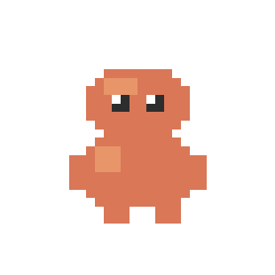

<p align="center">
  
</p>

# Claude Pet

Desktop mascot that visualizes active Claude Code sessions as animated pixel-art pets. Each running session spawns a pet that walks, types, celebrates, or shows errors depending on what Claude is doing. Pets are color-coded and sized by model family, get random names, and show rich tooltips with tool details.

Built with **Tauri v2** (Rust backend) + **vanilla TypeScript** (canvas frontend). The window is transparent, always-on-top, click-through, and lives above your macOS dock. No dock icon — menu bar only.

## Features

- One pet per active Claude Code session, plus mini-pets for subagents
- Model-aware skins: Opus (gold, large), Sonnet (orange, medium), Haiku (green, small)
- 6 animation states: idle walk, thinking (scratching head), working (laptop typing), done (celebration), error (dizzy), attention (waving)
- Drag-and-drop pets anywhere on screen, double-click to reset position
- Rich hover tooltips: pet name, model tag, current tool + file/command detail, elapsed time
- Project name label above each pet
- System tray controls: click-through toggle, visibility toggle, quit
- Subagent tracking: spawned agents appear as small Haiku-colored pets near their parent

## Prerequisites

- **macOS** (uses macOS private API for transparent WKWebView)
- **Rust** toolchain (`rustup` + stable)
- **Node.js** 20+ and **pnpm**
- **Claude Code** CLI installed and working

## Installation

```bash
git clone https://github.com/floatrx/claude-pet.git
cd claude-pet
pnpm install
```

## Claude Code Hooks Setup

The hook at `hooks/pet-state-writer.mjs` writes session state to `~/.claude/pet-state.json` on every Claude Code lifecycle event.

### Register the hook

Add to your Claude Code settings (`~/.claude/settings.json`):

```json
{
  "hooks": {
    "SessionStart": [
      {
        "matcher": "",
        "hooks": [
          {
            "type": "command",
            "command": "node /absolute/path/to/claude-pet/hooks/pet-state-writer.mjs"
          }
        ]
      }
    ],
    "PreToolUse": [
      {
        "matcher": "",
        "hooks": [
          {
            "type": "command",
            "command": "node /absolute/path/to/claude-pet/hooks/pet-state-writer.mjs"
          }
        ]
      }
    ],
    "PostToolUse": [
      {
        "matcher": "",
        "hooks": [
          {
            "type": "command",
            "command": "node /absolute/path/to/claude-pet/hooks/pet-state-writer.mjs"
          }
        ]
      }
    ],
    "UserPromptSubmit": [
      {
        "matcher": "",
        "hooks": [
          {
            "type": "command",
            "command": "node /absolute/path/to/claude-pet/hooks/pet-state-writer.mjs"
          }
        ]
      }
    ],
    "Stop": [
      {
        "matcher": "",
        "hooks": [
          {
            "type": "command",
            "command": "node /absolute/path/to/claude-pet/hooks/pet-state-writer.mjs"
          }
        ]
      }
    ]
  }
}
```

> Replace `/absolute/path/to/claude-pet` with your actual project path.

### Hook events

| Event | Status written | Pet behavior |
|---|---|---|
| `SessionStart` | `idle` + model detection | New pet spawns with model-colored skin, walks around |
| `UserPromptSubmit` | `thinking` | Pet scratches head with floating thought dots |
| `PreToolUse` | `tool_use` + tool detail | Pet sits with laptop, typing (tooltip shows tool + file/command) |
| `PostToolUse` | `thinking` | Pet goes back to scratching head between tools |
| `Stop` | Session removed | Pet disappears; child subagents also removed |
| `SubagentStart` | Subagent added | Mini Haiku-colored pet spawns near parent |
| `SubagentStop` | Subagent removed | Mini pet disappears |
| `Notification` | `needsAttention: true` | Pet waves arm with exclamation mark (permission prompt) |

### State file

The hook writes to `~/.claude/pet-state.json`:

```json
{
  "sessions": [
    {
      "id": "session-abc123",
      "status": "tool_use",
      "tool": "Read",
      "toolDetail": "main.ts",
      "model": "opus",
      "project": "claude-pet",
      "needsAttention": false,
      "since": 1711900000
    }
  ],
  "subagents": [
    {
      "id": "agent-xyz",
      "parentId": "session-abc123",
      "type": "Explore",
      "status": "tool_use",
      "since": 1711900050
    }
  ]
}
```

Sessions and subagents older than 30 minutes are automatically cleaned up.

## Running

### Development

```bash
pnpm tauri dev
```

Starts Vite dev server on `localhost:1420` and launches the Tauri window. Hot-reload is active for frontend changes; Rust changes trigger a rebuild.

### Production build

```bash
pnpm tauri build
```

Outputs platform-specific installers to `src-tauri/target/release/bundle/`:

| Platform | Output | Location |
|---|---|---|
| macOS | `.dmg` + `.app` | `bundle/dmg/claude-pet_0.1.0_aarch64.dmg` |
| macOS | Standalone `.app` | `bundle/macos/claude-pet.app` |

#### Build requirements

- **Rust** stable toolchain (install via [rustup.rs](https://rustup.rs))
- **Xcode Command Line Tools** — `xcode-select --install`
- **Node.js** 20+ and **pnpm** — `npm i -g pnpm`

#### Step-by-step

```bash
# 1. Install frontend dependencies
pnpm install

# 2. Build the app (compiles Rust + bundles frontend)
pnpm tauri build

# 3. Open the DMG to install
open src-tauri/target/release/bundle/dmg/*.dmg
```

The build runs `tsc && vite build` for the frontend, then compiles the Rust backend in release mode. First build is slower due to Cargo dependency compilation.

#### Installing the built app

1. Open the `.dmg` file
2. Drag `claude-pet.app` to Applications
3. On first launch, macOS may block it — go to **System Settings > Privacy & Security** and click **Open Anyway**

### Type checking

```bash
tsc -b
```

## Architecture

```
Claude Code hooks --> ~/.claude/pet-state.json --> Rust file watcher --> Tauri event --> Canvas renderer
```

### Rust backend (`src-tauri/src/`)

- `lib.rs` — App setup: fullscreen transparent window, system tray (click-through / visibility / quit), file watcher on `~/.claude/pet-state.json`. Detects macOS dock height via Swift/AppKit. Hidden from dock via `LSUIElement`.
- `state.rs` — `PetState` / `Session` / `Subagent` types, reads and deserializes state JSON.

### TypeScript frontend (`src/`)

- `main.ts` — Entry point: canvas setup, Tauri event listeners, cursor polling, drag-and-drop, double-click reset, pet lifecycle (spawn/update/remove for sessions and subagents), animation loop.
- `pet.ts` — `Pet` class: per-model scale and sprite caching, movement, animation, hit testing, project label rendering, rich tooltip with pet name + model tag + tool detail + elapsed time.
- `sprites.ts` — Procedurally generates all sprite frames on `OffscreenCanvas` (32x32 pixel art, scaled per model). Six animation sets: idle, thinking, working, done, error, attention. Accepts model colors for themed skins.
- `state.ts` — Pub/sub: `onStateChange(callback)` receives sessions + subagents on every update.
- `types.ts` — `SessionStatus`, `AnimationState`, `ModelFamily`, `ModelTheme`, `SpriteSheet`, `Subagent`. Model theme definitions with per-family colors and scale.
- `names.ts` — Deterministic pet name generator from session ID hash (adjective + noun, e.g. "Swift Claude", "Cosmic Byte").

### Model themes

| Model | Body color | Scale | Accent |
|---|---|---|---|
| Opus | Gold `#C4843C` | 2.5x (80px) | `#FFD700` |
| Sonnet | Orange `#D97757` | 2x (64px) | `#4A90D9` |
| Haiku | Green `#5BAD7A` | 1.5x (48px) | `#A8E6CF` |

### Session status to animation mapping

| Session status | Animation | Visual |
|---|---|---|
| `idle` | `idle` | Walking with bob and periodic blink |
| `thinking` | `thinking` | Scratching head, eyes looking up, floating thought dots |
| `streaming` | `working` | Sitting with laptop, typing arms alternate |
| `tool_use` | `working` | Same as streaming (tool name shown in tooltip) |
| `done` | `done` | Jumping with raised arms and sparkles |
| `error` | `error` | Shaking with red X-eyes and dizzy stars |
| `needsAttention` | `attention` | Bouncing, waving arm, red exclamation mark |

### Interactions

| Action | Behavior |
|---|---|
| **Hover** | Cursor changes to `grab`, shows tooltip with name, model, tool detail, elapsed time |
| **Click + drag** | Cursor changes to `grabbing`, pet follows mouse freely |
| **Double-click** | Pet resets to default position (above dock, random X) |
| **System tray > Click-through** | Toggle whether mouse passes through to apps below |
| **System tray > Visible** | Show/hide the overlay window |
| **System tray > Quit** | Exit the app |

### Window behavior

- **Transparent** — no background, pets float over your desktop
- **Always on top** — visible over all windows
- **No dock icon** — app only appears in the menu bar (system tray)
- **Click-through** — mouse events pass through by default, disabled on pet hover
- **Full screen canvas** — pets can be dragged anywhere on screen

## Tauri Capabilities

| Permission | Purpose |
|---|---|
| `core:window:allow-cursor-position` | Poll cursor position for hover detection |
| `core:window:allow-set-ignore-cursor-events` | Toggle click-through on pet hover |
| `core:window:allow-outer-position` | Calculate cursor position relative to window |
| `core:window:allow-inner-size` | Canvas sizing |
| `core:window:allow-scale-factor` | HiDPI / Retina scaling |

## Rust Dependencies

| Crate | Purpose |
|---|---|
| `tauri` 2.x | App framework (`macos-private-api` + `tray-icon` features) |
| `notify` 7.x | Filesystem watcher for `pet-state.json` |
| `serde` / `serde_json` | JSON serialization |
| `dirs` 6.x | Resolve `~/.claude/` path |

## Troubleshooting

**Pets not appearing when Claude Code is running**
- Check hooks are registered in `~/.claude/settings.json`
- Verify the hook path is absolute and correct
- Check `~/.claude/pet-state.json` exists and has sessions: `cat ~/.claude/pet-state.json`
- Ensure the Tauri app is running (`pnpm tauri dev`)

**Wrong pet color/size**
- Model detection happens on `SessionStart` only. If hooks were registered mid-session, restart Claude Code to trigger a new `SessionStart` event.

**Subagent pets not appearing**
- `SubagentStart` / `SubagentStop` events must be registered. These are emitted by Claude Code when using the Agent tool.

**Window not transparent on macOS**
- `macOSPrivateApi: true` must be set in `tauri.conf.json` (already configured)
- Restart the app after any Tauri config changes

**Click-through not working**
- Check system tray menu — "Click-through" should be checked
- Grant accessibility permissions if prompted by macOS

**Pet stuck after Claude session ends**
- Sessions are cleaned after 30 minutes of inactivity
- The `Stop` hook event removes sessions immediately — check hook registration

## License

MIT
